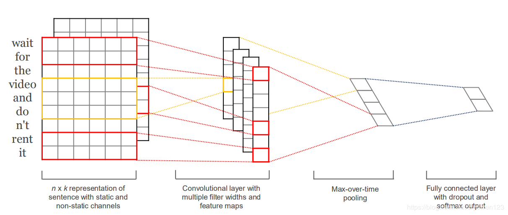
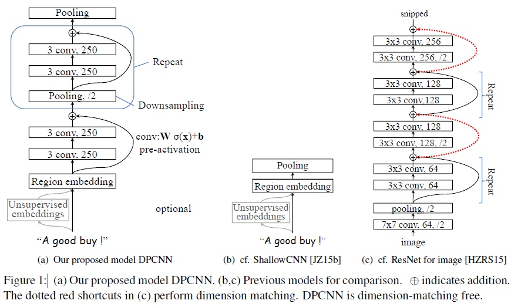
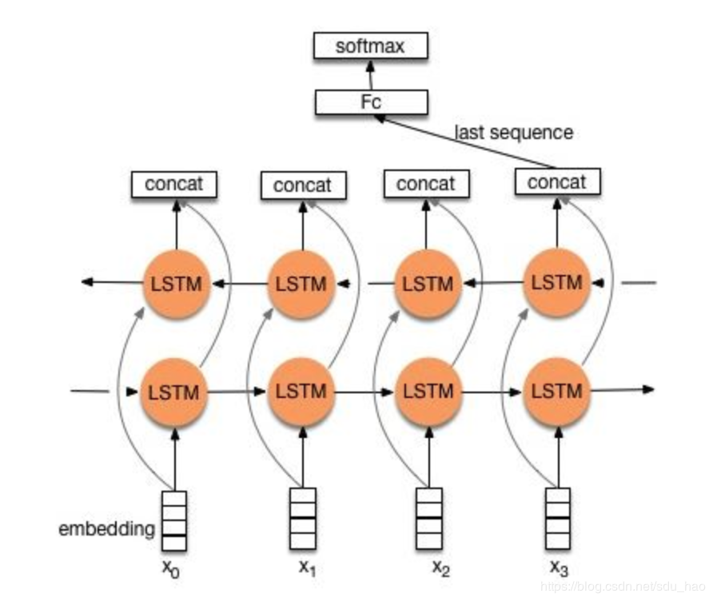
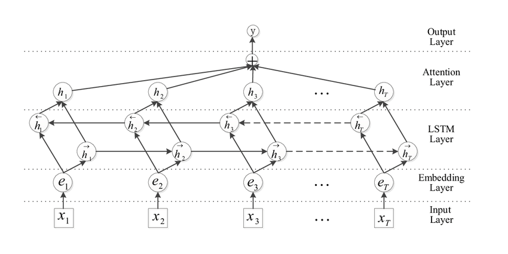
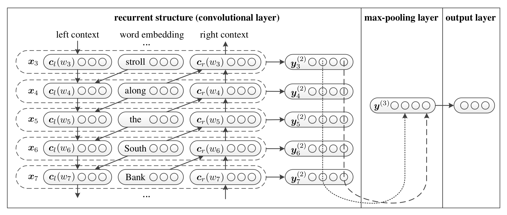

# Capstone Project

## 文件结构

`data/` 各种数据

`config/` 模型超参数

`src/` 源代码

`model/` 训练好的模型和日志

[word2vec预训练词向量](https://pan.baidu.com/s/1pUqyn7mnPcUmzxT64gGpSw)，生成的词表已经保存在data文件夹下。

## Performance

以测试集准确率为优化指标。所有的模型都是char-level的，没有分词。

都是最终结果了。考虑到软硬件的不同，不保证100%可复现，`model`文件夹下载[地址](https://cloud.tsinghua.edu.cn/d/115cba163e02481e9924/)。

| Model    | Acc    | 注                                                  |
| -------- | ------ | ----------------------------------------------------- |
| fastText (bow) | 90.01% | 随机初始化词向量 |
| fastText(2-gram) | 90.01% |  |
| fastText(3-gram) | 92.54% |  |
| TextCNN | 91.46% |  |
| DPCNN    | 92.00% | Repeat Layer = 3 |
| BiLSTM | 91.58% |                                                       |
| BiLSTM with Attention | 91.60% ||
| TextRCNN | 91.79% | BiLSTM + max pooling                                  |
| BERT | 94.61% | [来源](https://github.com/ymcui/Chinese-BERT-wwm), BERT-wwm-ext |

fastText从2gram到3gram准确率有很大的提高，说明相邻3个字的语义对于分类非常关键。

## Usage

```shell
# 在src文件夹下运行命令行
python .\run.py --config .\config\FT.json  # fastText

python .\run.py --config .\config\CNN.json
python .\run.py --config .\config\DPCNN.json  

python .\run.py --config .\config\RNN.json
python .\run.py --config .\config\RNN_Att.json
python .\run.py --config .\config\RCNN.json

python .\run.py --config .\config\BERT.json
```

改变json文件中的`load`和`num_epochs`，可以选择是否加载模型和训练的epoch数。

## 模型介绍

### fastText

[fastText](https://arxiv.org/pdf/1607.01759.pdf)是一种简洁高效的文本分类模型，其思路是将所有输入文本的(也可包含2-gram和3-gram信息)词向量取平均后，经过一个MLP输出。虽然简单，但往往比许多深度模型更有效。

如果使用全部2-gram或3-gram，则词表太大，比如在我们这个数据集上单字符有不到5000个，2-gram和3-gram却分别有50万和数百万个。原论文解决这个问题的办法是哈希。

fastText也是训练词向量的方法之一。


### TextCNN

[TextCNN](https://arxiv.org/abs/1408.5882)通过对词向量序列的卷积操作，提取输入文本的2-gram，3-gram乃至n-gram信息，沿着每个卷积核的输出（时间步）做max pooling，在全连接层前用dropout防止过拟合。

卷积层能有效提取局部的语义信息，缺点之一是捕捉不到长距离关系。



### Deep Pyramid CNN

在TextCNN的基础上加入了重复多次的池化-卷积-卷积操作，每经过一次池化，序列的长度就缩短一半，这样，越靠上的卷积层就越能提取出序列宏观层面的信息；且因为序列长度的减半，模型消耗的计算资源得到了有效的降低。



图中的Shallow CNN就是TextCNN.

### BiLSTM

用双向LSTM进行文本分类，取其最后一个时间步上的隐状态过分类器。

在短文本分类中很有效，但如果文章很长，这样做会丢失大量中间信息。



### BiLSTM with Attention

为了解决BiLSTM的问题，引入注意力机制。取双向LSTM所有时间步的隐状态输入Self Attention层，将Attention层的输出沿着时间步求和。



也可以在TextCNN的卷积层前面加self attention，但是我估计不会有质的提升，不做了。

### TextRCNN

结合了BiLSTM和TextCNN的结构。它将双向LSTM的输入和输出拼接在一起，再做max pooling，然后经全连接层输出。

其实就是把TextCNN中的卷积层换成双向LSTM。



### BERT

性能上的天花板，原理就不管了。

